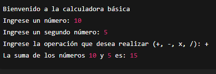

# 🧮 Calculadora Básica

Este proyecto es una **calculadora en Python** que permite realizar las cuatro operaciones matemáticas principales:  

- ➕ Suma  
- ➖ Resta  
- ✖️ Multiplicación  
- ➗ División  

---

## 🚀 Cómo usarla
1. Asegúrate de tener **Python 3** instalado en tu computadora.  
2. Clona este repositorio o descarga el archivo `calculadoraBasica.py`.  
3. En la terminal, navega a la carpeta del proyecto y ejecuta:  

```bash
python calculadoraBasica.py
