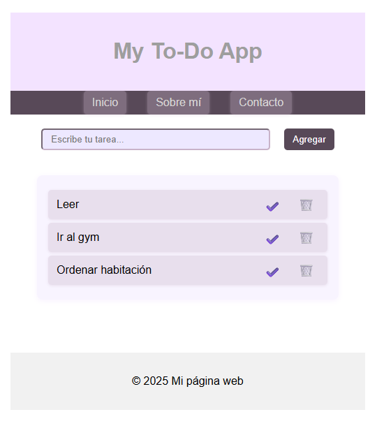

---

## 📂 2. `ToDoApp/README.md`
```markdown
# ✅ To-Do App

Este proyecto es una **aplicación sencilla en HTML, CSS y JavaScript** que permite crear una lista de tareas.  

---

## ✨ Funcionalidades
- Agregar nuevas tareas.  
- Ver las tareas en una lista.  
- (Opcional) Marcar tareas como realizadas.  

---

## 🚀 Cómo usarla
1. Clona este repositorio o descarga la carpeta `ToDoApp`.  
2. Abre el archivo `index.html` en tu navegador.  
3. Escribe una tarea en el campo de texto y presiona el botón **Agregar**.  
4. La tarea aparecerá en la lista.  

---

## 📸 Vista previa





---

## 🛠️ Tecnologías utilizadas
- HTML5  
- CSS3  
- JavaScript
